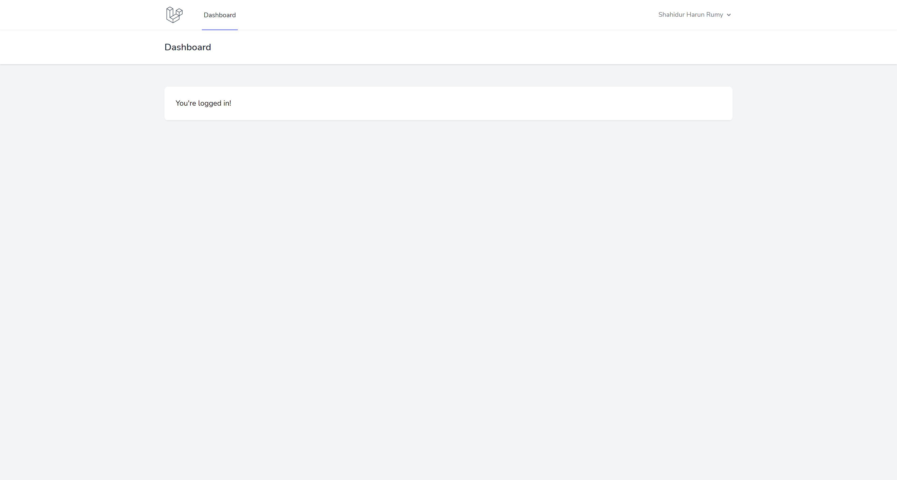

# Laravel login/register with OAuth providers using Laravel Socialite

A simple laravel project for demonstration purpose. Based on Laravel 8.X with Laravel Breeze.

## Requirements

- Laravel 8.X
- \>= PHP 7.3

## Installation

```
git clone https://github.com/rumyTM/laravel-login-with-oauth-providers.git
cd laravel-login-with-oauth-providers
composer install
cp .env.example .env
php artisan key:generate
php artisan migrate
```

## Screenshots

#### Login


#### Register


#### Select Google Account


#### Register using OAuth Provider


#### Dashboard


